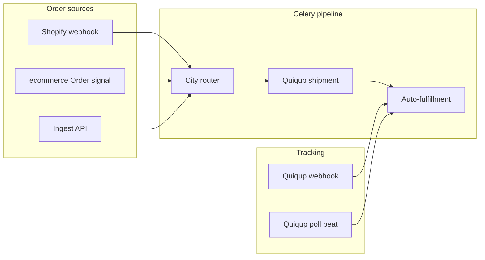

# Ecommerce API — integration guide

This project exposes a **Django REST Framework** JSON API for catalog data (collections, products, variants, options, tags). Use this document when connecting a storefront, mobile app, or internal tool.

## Base URL and versioning

- **API prefix:** `/api/v1/`
- **Example (local):** `http://localhost:8000/api/v1/`
- Replace the host with your deployed origin in production.

### React storefront in this workspace

The Vite app prefixes requests with **`/api/v1`** (proxy) or with **`VITE_API_ORIGIN` + `/api/v1`**; see `src/api/client.ts`.

- **`pnpm dev`:** Leave `VITE_API_ORIGIN` unset so requests use **`/api/v1/...`**; `vite.config.ts` proxies **`/api`** to **`http://localhost:8000`** (matches local Django).
- **Production build:** Set **`VITE_API_ORIGIN`** to your deployed API origin (HTTPS). Django must allow **CORS** for the storefront origin unless you proxy through the same host.

See `.env.example`.

## OpenAPI (machine-readable spec + UI)

- **OpenAPI schema (JSON):** `GET /api/schema/`
- **Swagger UI:** `GET /api/docs/`

Prefer the schema or Swagger for field-by-field detail; it stays aligned with the code via **drf-spectacular**.

## Request and response format

- **JSON only** for request bodies: `Content-Type: application/json`
- **Responses:** JSON (`DEFAULT_RENDERER_CLASSES` is `JSONRenderer`).

### Images and uploads

- Models use **ImageField** values; storage is configured for **Cloudinary** (see Django `DEFAULT_FILE_STORAGE` / `STORAGES`).
- API responses expose image fields as **URLs** (strings) when files are present.
- Uploading images typically requires **multipart** requests. The project’s default parsers are **JSON-only**; if you need browser or mobile **direct file upload** through the API, you will likely need to extend DRF with `MultiPartParser` / `FormParser` on the relevant views—plan integration accordingly.

## Authentication and permissions

- Viewsets currently use **`AllowAny`**: catalog endpoints are **public** and do **not** require a token.
- `SPECTACULAR_SETTINGS` references JWT for documentation purposes; **JWT is not wired as default authentication** in `REST_FRAMEWORK` in the current codebase. Treat the API as **unauthenticated** unless you add auth classes and align permissions.

**Production:** Do not rely on open write access; add authentication and narrow permissions before exposing create/update/delete to the internet.

## Resources and routes

DRF’s **`DefaultRouter`** registers these **ModelViewSet** resources (full CRUD where not blocked by serializers—see [Writes and nested data](#writes-and-nested-data)):

| Resource            | URL path                     | Notes |
|---------------------|------------------------------|--------|
| Collections         | `/api/v1/collections/`       | Includes computed `products_count` on read |
| Products            | `/api/v1/products/`          | Nested data on read; see below |
| Product variants    | `/api/v1/variants/`          | FK: `product` |
| Product options     | `/api/v1/options/`           | FK: `product`; nested `values` on read |
| Option values       | `/api/v1/option-values/`     | FK: `option` |
| Tags                | `/api/v1/tags/`              | Unique `name` |

### Standard actions (per resource)

| Action        | Method | Path pattern        |
|---------------|--------|----------------------|
| List          | GET    | `/api/v1/{resource}/` |
| Create        | POST   | `/api/v1/{resource}/` |
| Retrieve      | GET    | `/api/v1/{resource}/{id}/` |
| Full update   | PUT    | `/api/v1/{resource}/{id}/` |
| Partial update| PATCH  | `/api/v1/{resource}/{id}/` |
| Delete        | DELETE | `/api/v1/{resource}/{id}/` |

### Product read response (shape)

`GET /api/v1/products/{id}/` returns a product with nested objects (all read-only in the serializer):

- **`collection`** — nested collection object (if set)
- **`tags`** — list of tag objects
- **`variants`** — variants with nested **`option_values`**
- **`options`** — options with nested **`values`**
- **`min_price`** / **`max_price`** — derived from variant prices

### Domain model summary (fields to expect)

Common metadata on most entities: **`id`**, **`created_at`**, **`updated_at`** (from `TimeStampedModel`).

- **Collection:** `title`, `handle` (auto from title if empty), `description`, `image`, `is_active`, **`products_count`** (read)
- **Tag:** `name` (unique)
- **Product:** `title`, `handle`, `description`, `collection` (FK), `tags` (M2M), `featured_image`, `vendor`, `product_type`, **`status`** (`draft` \| `active` \| `archived`), `is_published`
- **ProductOption:** `product`, `name` — unique per product
- **ProductOptionValue:** `option`, `value` — unique per option
- **ProductVariant:** `product`, `title`, `sku`, `barcode`, `price`, `compare_at_price`, `cost_per_item`, `inventory_quantity`, `weight`, `is_active`, `image`, `option_values` (M2M)

## Writes and nested data

The **`ProductSerializer`** declares **`collection`**, **`tags`**, **`variants`**, and **`options`** as **read-only** nested representations. That means:

- You **cannot** set **`collection`** or **`tags`** on create/update through the product serializer as currently written.
- Nested **`variants`** / **`options`** are not written via the product payload; manage them via **`/api/v1/variants/`**, **`/api/v1/options/`**, **`/api/v1/option-values/`** using the appropriate foreign keys (`product`, `option`).

If your integration requires assigning a product to a collection or tags over the API, the backend needs serializer changes (e.g. writable `PrimaryKeyRelatedField` for `collection` and `tags`) or separate endpoints.

## Integration checklist

1. Point clients at **`{ORIGIN}/api/v1/`** (and **`/api/docs/`** during development).
2. Prefer **GET** for catalog reads; cache product lists if traffic is high.
3. Create **options → option values → variants** in order, linking `product` / `option` IDs from prior responses.
4. Plan **image** handling (JSON-only parsers vs multipart) before relying on file upload from clients.
5. Lock down **writes** and add **real authentication** before production.

---

## React storefront — checkout, payments, orders

The Vite app implements the native **ecommerce** checkout path that feeds the logistics pipeline when Django creates an `ecommerce.Order`.

### Routes

| Path | Component | Role |
|------|-----------|------|
| `/checkout` | `Checkout.tsx` | Server-backed checkout + payment choice |
| `/checkout/success` | `CheckoutSuccess.tsx` | Stripe return; confirm session → order |
| `/checkout/cancel` | `CheckoutCancel.tsx` | Abandoned Stripe Checkout |
| `/orders/:orderId` | `OrderDetail.tsx` | Order receipt + fulfillment panels |

### Checkout API (used by the UI)

All paths are under `/api/v1/` (see `src/api/checkout.ts`, `src/api/stripe.ts`, `src/api/orders.ts`).

| Action | Method | Path |
|--------|--------|------|
| Create checkout | POST | `/checkouts/` |
| Load / patch checkout | GET, PATCH | `/checkouts/{id}/` |
| Line items | POST, PATCH | `/checkout-line-items/` |
| Discount / gift card | POST | `/checkouts/{id}/apply-discount/`, `remove-discount/`, `apply-gift-card/`, `remove-gift-card/` |
| Complete (COD / zero total) | POST | `/checkouts/{id}/complete/` |
| Stripe config | GET | `/stripe/config/` |
| Stripe Checkout session | POST | `/checkouts/{id}/payment-session/` |
| Confirm Stripe return | GET | `/stripe/session/{session_id}/confirm/` |
| Orders | GET | `/orders/`, `/orders/{id}/` |

Types: `src/types/commerce.ts`. Helpers: `src/utils/commerce.ts`, `src/utils/stripeCheckout.ts`.

### Payment flow

```mermaid
flowchart TD
  A[PATCH checkout + address] --> B{Payment required?}
  B -->|No| C[POST complete]
  B -->|Yes, Stripe| D[POST payment-session]
  D --> E[Redirect to Stripe]
  E --> F[/checkout/success?session_id=]
  F --> G[GET stripe/session/confirm]
  G --> H[/orders/:id]
  B -->|Yes, COD| C
  C --> H
```

1. **Bootstrap** — `POST /checkouts/` + line items from cart; resume open checkout via `sessionStorage` (`storefront_ck_id`, `storefront_ck_fp`).
2. **Shipping** — UI applies `DEFAULT_CHECKOUT_SHIPPING_PKR` (250) via `PATCH` when the API has not set `shipping_total` (`src/utils/commerce.ts`).
3. **Payment modes** — From `GET /stripe/config/`: **Stripe** when `enabled` or `payment_options.stripe_checkout_available`; **COD** when `payment_options.cod` (or legacy `manual_complete`). URLs from `effective_checkout_urls` / `generated_checkout_urls`, else `{origin}/checkout/success?session_id={CHECKOUT_SESSION_ID}` and `{origin}/checkout/cancel`.
4. **Stripe** — `POST .../payment-session/` then `window.location.assign(checkout_url)`.
5. **COD / free** — `POST .../complete/` then navigate to order or account.
6. **Success page** — `confirmStripeSession` with retries; clears cart; fallback match on latest `paid` order.

Authenticated customers prefill contact/shipping from `GET` customer profile and addresses.

### Orders and fulfillment in the UI

- **Order list / detail** — `financial_status` badges; aggregate and per-line fulfillment via `order.fulfillments` and `fulfillment_service_detail` (`src/utils/orderDisplay.ts`, `src/components/OrderDetail.tsx`).
- **Logistics link** — Completing checkout (Stripe or COD) creates a backend `Order`; logistics `post_save` enqueues shipment processing (see below). COD orders use `financial_status: pending` for courier COD.

---

## Logistics — shipping and fulfillment (backend)

Centralized shipping for **Shopify**, this **ecommerce** checkout, and external systems via a **custom ingest API**. Courier routing uses admin city rules; shipments go through **Quiqup**; tracking and fulfillments sync back to each platform.

Base URL: `/api/v1/logistics/`.

### Architecture



| Step | Task | Description |
|------|------|-------------|
| 1 | Ingest | Normalize order → `Shipment` |
| 2 | `process_shipment_pipeline` | Route city → create Quiqup order → fulfill |
| 3 | Tracking | Quiqup webhook or scheduled poll → status + tracking sync |

### Integrations at a glance

| Integration | Trigger | Auth / config | Fulfillment target |
|-------------|---------|---------------|-------------------|
| **Shopify** | `orders/create` webhook | Per-store HMAC + domain in Django admin | Shopify Admin API fulfillment |
| **Ecommerce** | `post_save` on new `ecommerce.Order` | None (internal signal) | `ecommerce.Fulfillment` via `create_order_fulfillment` |
| **Custom ingest** | `POST /api/v1/logistics/orders/ingest/` | Bearer `ingest_api_token` (admin singleton) | Platform set by `source_platform` |
| **Quiqup** | Pipeline step + tracking | `QUIQUP_*` env vars | N/A (courier) |

### HTTP endpoints

| Method | Path | Purpose |
|--------|------|---------|
| `POST` | `/api/v1/logistics/webhooks/shopify/orders-create/` | Shopify order creation webhook |
| `POST` | `/api/v1/logistics/webhooks/quiqup/` | Quiqup tracking / status updates |
| `POST` | `/api/v1/logistics/orders/ingest/` | External order ingest (Bearer token) |

### Native ecommerce orders (this storefront)

When a new `ecommerce.Order` is created (checkout **complete** or Stripe **confirm**), `logistics.signals` enqueues `process_custom_order` (skipped if a shipment already exists). COD is inferred when `financial_status` is `pending`. Fulfillments are created when **Fulfillment configuration → auto_fulfill_enabled** is on; the React app reads them on `GET /orders/{id}/`.

### Custom ingest API

Set **Fulfillment configuration → ingest_api_token** in admin:

```http
POST /api/v1/logistics/orders/ingest/
Authorization: Bearer <ingest_api_token>
Content-Type: application/json
```

Example body (include `ecommerce_order_id` when linking to an existing order):

```json
{
  "source_platform": "ecommerce",
  "external_order_id": "ext-12345",
  "order_number": "#1001",
  "ecommerce_order_id": 42,
  "city": "Lahore",
  "customer": { "name": "Jane Doe", "email": "jane@example.com", "phone": "+923001234567" },
  "shipping_address": { "address1": "123 Main St", "city": "Lahore", "country": "PK" },
  "line_items": [{ "title": "T-Shirt", "sku": "TS-01", "quantity": 2 }],
  "cod_amount": "1500.00"
}
```

Response **202**: `{ "shipment_id": <id>, "correlation_id": "<uuid>" }`.

### Shopify, Quiqup, Celery, admin

- **Shopify** — Admin → Logistics → Shopify stores (`shop_domain`, `access_token`, `webhook_secret`). Webhook URL: `https://YOUR_DOMAIN/api/v1/logistics/webhooks/shopify/orders-create/`. HMAC via `X-Shopify-Hmac-Sha256`; unknown/inactive stores → **403**.
- **Quiqup** — Env: `REDIS_URL`, `QUIQUP_BASE_URL`, `QUIQUP_CLIENT_ID`, `QUIQUP_CLIENT_SECRET`, `LOGISTICS_QUIQUP_POLL_MINUTES`. Webhook: `POST .../webhooks/quiqup/`; optional `quiqup_webhook_secret` in Fulfillment configuration.
- **Celery** — `celery -A settings worker -l info -Q logistics --concurrency=4` plus beat with `django_celery_beat`. Tasks: `process_shipment_pipeline`, `process_shopify_order_webhook`, `process_custom_order`, `sync_tracking_updates`, `poll_quiqup_tracking_batch`.
- **Admin models** — Shopify stores, city fulfillment rules, courier configurations, fulfillment configuration (singleton: auto-fulfill, tracking sync, ingest token, Quiqup webhook secret).
- **Local seed** — From Django project root: `DJANGO_USE_SQLITE=1 ./venv/bin/python manage.py seed_logistics`.

Detailed backend docs (when present on the API repo): `docs/logistics/overview.md`, `shopify-webhooks.md`, `quiqup-integration.md`, `django-admin-setup.md`, `celery-workers.md`, `env-reference.md`, `seed-data.md`.

---

## AI assistant prompt (copy-paste)

Use the block below in Cursor or another AI tool when generating a client, tests, or UI against this backend.

```text
You are integrating with a Django REST Framework ecommerce API and optional logistics service.

Base URL: {ORIGIN}/api/v1/
Logistics prefix: {ORIGIN}/api/v1/logistics/

Catalog (public reads): collections, products, variants, options, option-values, tags.
Commerce: checkouts, checkout-line-items, orders; Stripe at /stripe/config/, /stripe/session/{id}/confirm/, POST /checkouts/{id}/payment-session/.
Logistics: POST /logistics/webhooks/shopify/orders-create/, /logistics/webhooks/quiqup/, /logistics/orders/ingest/ (Bearer ingest_api_token).

React storefront (this repo): /checkout, /checkout/success, /checkout/cancel, /orders/:id. Stripe return uses session_id query param; COD uses POST /checkouts/{id}/complete/. New ecommerce.Order triggers logistics process_custom_order.

Facts:
- JSON request/response; OpenAPI at GET /api/schema/, Swagger at GET /api/docs/.
- Products GET: nested collection, tags, variants, options; collection/tags not writable on product serializer—use FK endpoints.
- Checkout: patch address/shipping; payment via Stripe redirect or COD complete; fulfillment on orders via nested fulfillments[].
- Permissions: catalog AllowAny unless changed; auth for customer profile/orders as implemented on server.

Prefer OpenAPI for field-level detail. Validate HTTP status (401 ingest token, 403 Shopify store, 202 ingest accepted).
```

Replace `{ORIGIN}` with `http://localhost:8000` or your production host.
